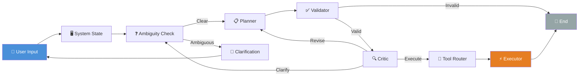
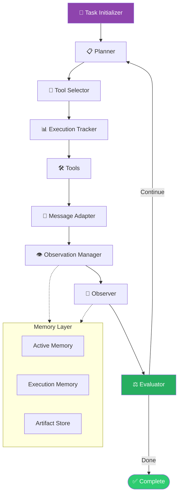
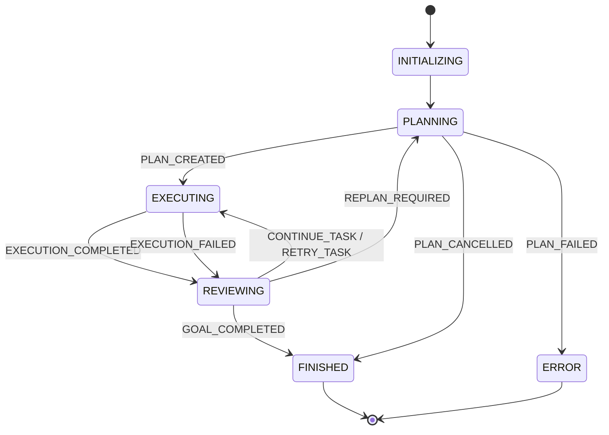

<div align="center">

# CASO

### **C**ontrolled **A**I **S**ystem **O**perator

*Natural language → structured intent → safe, controlled execution on your machine.*

<br/>

[](https://www.python.org/)
[](https://langchain-ai.github.io/langgraph/)
[](https://www.microsoft.com/windows)
[](LICENSE)

<br/>

[Overview](#-overview) ·
[Architecture](#-architecture) ·
[Agents](#-agents) ·
[Quick Start](#-quick-start) ·
[Project Structure](#-project-structure) ·
[Safety](#-safety) ·
[Roadmap](#-roadmap)

</div>

---

## ✨ Overview

**CASO** is a system-level AI operator — not a chatbot, not a simple macro runner. It turns natural-language goals into **structured plans**, validates them, reviews them with a critic, and executes them on your OS with **reasoning, memory, and guardrails**.

| Principle | What it means |
|-----------|---------------|
| **Clarify, don't guess** | Ambiguous requests trigger a clarification loop before any action |
| **Plan before act** | Hybrid planner produces structured steps — macros + tools |
| **Validate & critique** | Deterministic validators and an LLM critic gate execution |
| **Controlled execution** | Atomic tools, safety filters, and an emergency kill switch |

> **CASO asks → understands → acts.**  
> Most agents skip the first two steps. CASO doesn't.

---

## 🏗 Architecture

CASO ships two LangGraph agents, each optimized for a different operating mode.

### CASO Agent — Desktop Operator

The original pipeline for GUI-level automation: open apps, type text, press keys, and route through registered tools.



### TERMINAL Agent — Codebase & Shell Operator

A multi-node agent for file discovery, shell commands, artifact retrieval, and iterative task completion — with structured memory and a dedicated runtime kernel.



<details>
<summary><strong>🔁 Terminal Runtime State Machine</strong> — click to expand</summary>

<br/>

The runtime kernel (`agents/terminal/runtime/`) decouples orchestration from LangGraph. It owns deterministic mode transitions:



</details>

---

## 🤖 Agents

Both agents are registered in [`langgraph.json`](langgraph.json) and can be served via the [LangGraph CLI](https://langchain-ai.github.io/langgraph/cloud/reference/cli/).

| Agent | Graph entry | Best for |
|-------|-------------|----------|
| **CASO Agent** | `graph_/graph_builder.py:graph` | Desktop automation — apps, typing, GUI macros |
| **TERMINAL Agent** | `agents/terminal/graph.py:terminal_graph` | File search, shell ops, codebase analysis |

<details>
<summary><strong>🛠 TERMINAL Agent — available tools</strong></summary>

<br/>

| Tool | Capability |
|------|------------|
| `run_terminal` | Execute controlled shell commands |
| `list_directory` | Browse directory contents |
| `search_files` | Find files by name/pattern |
| `search_content` | Grep-like content search |
| `read_file` | Read file contents with line ranges |
| `get_file_info` | Metadata — size, modified time, type |
| `search_artifact` | Query stored execution artifacts |
| `read_artifact` | Retrieve artifact contents |

</details>

<details>
<summary><strong>⚡ CASO Agent — executor actions</strong></summary>

<br/>

The desktop executor (`executor/`) runs atomic actions via a registry:

- `open_app` — launch applications
- `type_text` — keyboard input
- `press_key` — single key presses
- `focus_app` — bring a window to foreground

Additional tools are routed through `tools/router.py` (e.g. `open_url`).

</details>

---

## 🚀 Quick Start

### Prerequisites

- **Windows 10/11** (primary target — uses `pyautogui`, `pywin32`, `psutil`)
- **Python 3.10+**
- At least one LLM backend:
  - [Ollama](https://ollama.com/) (local — default for ambiguity/planning)
  - [Groq](https://groq.com/) API key
  - Google Gemini API key
  - NVIDIA NIM endpoints (Terminal Agent planner)

### 1 · Clone & configure

```bash
git clone https://github.com/<your-org>/CASO.git
cd CASO
```

Create a `.env` file in the project root:

```env
# Pick the providers you use
GROQ_API_KEY=your_groq_key
GEMINI_API_KEY=your_gemini_key
NVIDIA_API_KEY=your_nvidia_key
```

### 2 · Install dependencies

```bash
# Recommended: use the bundled virtual environment
.\caso-lib\Scripts\activate        # Windows

# Or create your own venv and install core packages:
pip install langgraph langchain-core langchain-ollama langchain-groq \
            langchain-nvidia-ai-endpoints python-dotenv google-genai \
            pyautogui pygetwindow pywin32 psutil keyboard pydantic
```

### 3 · Run an agent

<details open>
<summary><strong>Option A — Interactive CASO Agent (CLI)</strong></summary>

<br/>

```bash
python main.py
```

The graph handles clarification interrupts automatically — answer follow-up questions when prompted, and the agent resumes execution.

</details>

<details>
<summary><strong>Option B — TERMINAL Agent (scripted)</strong></summary>

<br/>

```bash
python terminal_test.py
```

Edit the `goal` field in `terminal_test.py` to change the task:

```python
result = terminal_graph.invoke({
    "goal": "Find all planner-related files and explain how the planner is implemented.",
    # ...
})
```

</details>

<details>
<summary><strong>Option C — LangGraph Dev Server</strong></summary>

<br/>

```bash
langgraph dev
```

Opens a local studio UI for both **CASO Agent** and **TERMINAL Agent** graphs defined in `langgraph.json`.

</details>

---

## 📁 Project Structure

```
CASO/
├── agents/terminal/          # TERMINAL Agent — LangGraph nodes, tools, memory, runtime
│   ├── graph.py              # Terminal graph definition
│   ├── nodes/                # planner, evaluator, observer, safety, …
│   ├── runtime/              # Kernel, state machine, dispatcher
│   ├── memory/               # Artifact store, observation manager
│   └── tools/                # Shell, file, discovery tools
│
├── graph_/                   # CASO Agent — LangGraph pipeline
│   ├── graph_builder.py      # Main graph entry
│   ├── wrappers.py           # Node implementations
│   └── routers.py            # Conditional routing
│
├── classifier/               # Ambiguity detection
├── clarification/            # Clarification loop & resume handling
├── planner/                  # Plan generation & validation
├── critic/                   # Pre-execution plan review
├── executor/                 # Desktop action executor
├── tools/                    # Extensible tool registry
├── llm/                      # Multi-provider LLM client
├── state/                    # System state awareness
├── core/                     # Kill switch & control flags
│
├── main.py                   # Interactive CASO Agent CLI
├── terminal_test.py          # TERMINAL Agent smoke test
└── langgraph.json            # LangGraph server config
```

---

## 🛡 Safety

CASO is designed to **fail closed** — unsafe or ambiguous plans should not reach execution.

| Layer | Mechanism |
|-------|-----------|
| **Ambiguity gate** | Requests are classified before planning; unclear intent triggers clarification |
| **Plan validator** | Deterministic schema checks on every plan step |
| **Critic review** | LLM second opinion — can `EXECUTE`, `CLARIFY`, or `REVISE_PLAN` |
| **Safety filter** | Terminal Agent command validation before tool dispatch |
| **Kill switch** | `Ctrl + Shift + X` aborts in-flight execution immediately |

```python
# Enable the kill switch in your entry point:
from core.kill_switch import start_kill_switch
start_kill_switch()  # Listens for Ctrl+Shift+X
```

---

## 🧠 LLM Providers

CASO supports multiple backends through a unified client (`llm/llmclient.py`):

| Provider | Function | Typical use |
|----------|----------|-------------|
| **Ollama** | `call_ollama()` | Local inference — ambiguity, planning |
| **Groq** | `call_groq()` | Fast cloud inference — critic, evaluator |
| **Gemini** | `call_gemini()` | Google Generative AI |
| **NVIDIA NIM** | `call_nvidia()` | Terminal Agent structured planning |

Swap models by editing the relevant node or checker — no graph restructure required.

---

## 🗺 Roadmap

- [x] Phase 1 — Desktop operator pipeline (state → plan → execute)
- [x] Clarification loop with LangGraph interrupts
- [x] Critic-gated execution
- [x] TERMINAL Agent with file/shell tools
- [x] Structured memory & artifact store
- [x] Runtime kernel with deterministic state machine
- [ ] Browser automation tools
- [ ] Cross-platform support (Linux / macOS)
- [ ] Persistent checkpointing & session resume
- [ ] RAG over project docs (`vectorstore/`)

---

## 🤝 Contributing

Contributions are welcome. A good first read is the design conversation in [`flows/`](flows/) — it documents the architectural decisions behind each phase.

1. Fork the repo
2. Create a feature branch (`git checkout -b feature/my-capability`)
3. Commit your changes
4. Open a Pull Request

---

## 📄 License

This project is licensed under the [Apache License 2.0](LICENSE).

---

<div align="center">

**Built with reasoning, not guessing.**

<sub>CASO — Controlled AI System Operator</sub>

</div>
